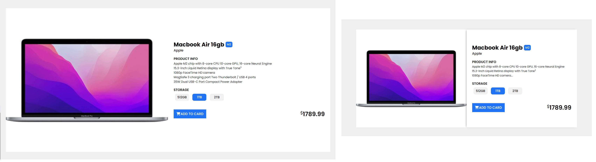

# Product Card

This project is an example that lets you create a product card using HTML and CSS. The project depicts the board of a Macbook Air product.

## Features

- Product title, brand and model information.
- Product features and descriptions.
- Storage options and buttons.
- Product price and 'Add to Cart' button.

## Technologies

- HTML
- CSS
- Font Awesome
- Google Fonts
# Product Card

Bu proje, bir ürün kartını HTML ve CSS kullanarak oluşturmanızı sağlayan bir örnektir. Proje, bir Macbook Air ürününün kartını tasvir etmektedir.

## Özellikler

- Ürün başlığı, marka ve model bilgisi.
- Ürün özellikleri ve açıklamaları.
- Depolama seçenekleri ve butonlar.
- Ürün fiyatı ve "Sepete Ekle" butonu.

## Teknolojiler

- HTML
- CSS
- Font Awesome
- Google Fonts

[Canlı Demo'yu Deneyin](https://fatihycan.github.io/Product-Card/)
